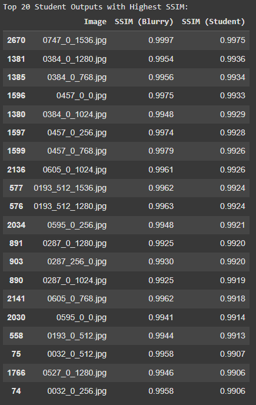
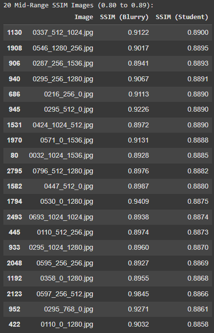

# Image Sharpening via Knowledge Distillation using Restormer and Mini-UNet

This repository showcases a complete pipeline for high-quality **Image Sharpening** using **Knowledge Distillation (KD)**. A pretrained **Restormer model** acts as the high-capacity **teacher**, while a lightweight **Mini-UNet model** is trained as the **student** to match the teacher’s performance.

The pipeline is designed for **efficient deployment** in real-world settings, where high-resolution image restoration is needed but **hardware resources are limited**.

---

## Project Overview

Traditional motion deblurring models either provide **high accuracy but are computationally heavy** (like Restormer), or are **lightweight but lose quality** (like basic U-Nets). Our solution combines the best of both:

- A **Restormer teacher model** generates high-quality sharp outputs from blurry images.
- A compact **Mini-UNet student** learns not only from ground truth (sharp images), but also from the teacher’s output — using:
  - **L1 Loss** for pixel accuracy  
  - **Distillation Loss** to mimic teacher behavior  
  - **VGG Perceptual Loss** to preserve visual quality

The student is trained to match the teacher’s performance, while being up to **10× smaller** and much faster — making it ideal for **mobile and edge devices**.

---

## Key Highlights

- Uses **Restormer** as a powerful pretrained teacher model
- Student model is a **custom Mini-UNet**, 3–4 layers deep, <30 MB
- Incorporates **multi-loss training** (L1 + KD + Perceptual)
- Based on **DIV2K dataset** with blurry/sharp pairs
- Full training, inference, and SSIM evaluation done in **Google Colab**
- **Resumable training** with checkpoint support
- Achieves strong SSIM (~0.90+) with high visual fidelity

---

### Dataset Used — DIV2K 

We use the **DIV2K dataset** (high-resolution image dataset) as the base for training and evaluation. The dataset is organized into paired blurry–sharp images for both training and benchmarking, with a strict triplet alignment to support knowledge distillation:

---

### Folder Structure
```
data/
├── whole_dataset/                  # Original DIV2K_train_HR images
├── blurry/
│   ├── train/
│   │   ├── train/                  # 80% of training images (blurry patches)
│   │   └── test/                   # 20% of training images (blurry patches)
│   └── benchmark/                  # 10% benchmark blurry images
├── sharp/
│   ├── train/
│   │   ├── train/                  # 80% of training images (sharp patches)
│   │   └── test/                   # 20% of training images (sharp patches)
│   └── benchmark/                  # 10% benchmark sharp images
```

### Key Details
- **Patch Size**: 512×512 (non-overlapping, center-cropped if needed)
- **Total Training Images (Patches)**: ~20,000 triplets
- **Benchmark Pairs**: ~100 full-size images for final SSIM evaluation
- **Sharpness Degradation**: Blur is synthetically added using downscale-upscale + motion blur for realism
- **Triplet Matching**: All blurry/sharp/teacher images are aligned by filename

---

📎 **More Details:** Refer to the [`data/README.md`](./data/README.md) for exact dataset preparation steps, patching logic, and source download references.

---

## Methodology – Knowledge Distillation + U-Net + VGG Loss

This project focuses on a **lightweight student network (Mini U-Net)** trained using a **knowledge distillation (KD)** framework. We leverage a powerful **Restormer** model as the teacher to guide and supervise the training of the student. The student learns not just from the ground truth (sharp images), but also from the intermediate guidance of the teacher's outputs. This results in improved sharpness, structural accuracy, and generalization—all while reducing model size and inference cost.

---

### Components of the Method

| Component            | Description                                                                 |
|----------------------|-----------------------------------------------------------------------------|
| **Teacher Model**    | Pretrained **Restormer** (Motion Deblurring model)                         |
| **Student Model**    | Mini **U-Net** (2–3 encoding–decoding blocks with skip connections)         |
| **Distillation Type**| Output-based regression (pixel-wise teacher output)                         |
| **Input Patch Size** | 512×512 patches                                                             |
| **Training Loss**    | `Total Loss = L1 + λ_kd * Distillation Loss + λ_vgg * Perceptual Loss`      |

---

### Loss Functions Used

| Loss Type             | Description                                                                                      | Weight |
|-----------------------|--------------------------------------------------------------------------------------------------|--------|
| **L1 Loss**           | Measures pixel-wise difference between student output and ground truth sharp image              | 1.0    |
| **Distillation Loss** | Measures difference between student output and teacher (Restormer) output                        | 1.0    |
| **VGG Perceptual Loss** | Computes high-level feature distance between student output and ground truth (using VGG16)   | 0.1    |

> All losses are computed on full-resolution patches and combined during training.

---

### Why Knowledge Distillation?

- **Performance**: Mimicking a strong teacher helps the student learn refined deblurring patterns  
- **Efficiency**: Enables real-time image sharpening on resource-constrained devices (e.g., mobile)  
- **Generalization**: The student learns smoother and more perceptually aligned reconstructions  

---

📎 See: [`training/train_student_kd.py`](./training/train_student_kd.py) for full implementation of the KD + VGG training pipeline.

---

## Model Architecture – Mini U-Net (Student)

The **student model** in this project is a highly efficient, custom **Mini U-Net**, specifically crafted to mimic the output of a large teacher (Restormer) while remaining fast and lightweight. It uses a **contracting path (encoder)** to capture context and an **expanding path (decoder)** for precise localization — a hallmark of the U-Net architecture.

This student network was chosen because:
- It supports sharpness recovery with skip connections
- Is fully convolutional (works on any image size)
- Can be easily downscaled or upscaled for faster or more accurate variants

---

### Architecture Overview

| Stage          | Details                                                                                   |
|----------------|--------------------------------------------------------------------------------------------|
| **Input**      | 3-channel RGB blurry image                                                                |
| **Encoder**    | 2 or 3 levels of: `Conv → BN → ReLU → Conv → BN → ReLU → MaxPool`                         |
| **Bottleneck** | Deepest layer with high-level feature representation                                      |
| **Decoder**    | Transposed Conv → Concatenate skip → `Conv → BN → ReLU → Conv → BN → ReLU`                |
| **Output**     | Final 1×1 Conv to restore 3-channel sharpened image                                       |

---

### U-Net Flowchart (3-Level Depth)

```
[Input Image (3xHxW)]
        │
        ▼
+---------------------+
|   Encoder Block 1   |  →→→→→→→→→→→→→→→→→→→→→→→→→→→→→→+
+---------------------+                                │
        │                                              ↓
        ▼                                    +---------------------+
+---------------------+                     |  Decoder Block 1    |
|   Encoder Block 2   |    ───── skip ───▶ | (UpSample + Conv)   |
+---------------------+                     +---------------------+
        │                                             ↓
        ▼                                   +---------------------+
+---------------------+                     |  Decoder Block 2    |
|   Bottleneck Block  |     ───── skip ───▶| (UpSample + Conv)    |
+---------------------+                     +---------------------+
        │                                             ↓
        ▼                                   +---------------------+
+---------------------+                     |   Output Conv 1x1   |
|  Sharpened Output   | ◀───────────────── |      RGB Output      |
+---------------------+                     +---------------------+
```

---

### Component-Level Explanation

| Component         | Description |
|-------------------|-------------|
| **ConvBlock**     | Two convolutional layers, each followed by BatchNorm and ReLU activation. |
| **Dropout (optional)** | Configurable dropout between layers (disabled by default). |
| **MaxPooling**    | Used for downsampling in the encoder. |
| **Transposed Conv** | Used for upsampling in the decoder (learnable). |
| **Skip Connections** | Preserve spatial detail by concatenating encoder features to decoder stages. |
| **Final Layer**   | 1×1 convolution to map to RGB output. |

---

### Model Configuration Used

```python
model = UNet(
    base_filters=64,       # Controls width of feature maps
    use_dropout=False,     # Dropout not used in final model
    depth=4                # 3 or 4 levels depending on tradeoff
)
```

---

### Parameter Count

| **Parameter Scope** | **Details**                          |
|---------------------|--------------------------------------|
| Total Params        | ~1.1M for `depth=3`                  |
| Student Size        | ~30 MB (trained weights, final)      |
| Checkpoints         | ~88 MB (includes optimizer state)    |

---

### Implementation File

- **Full model code**: [`models/student_model_unet.py`](./models/student_model_unet.py)
- Written in **PyTorch**
- Easily modifiable:
  - Dropout support
  - BatchNorm support
  - Optional residual connections

---

### Why This Mini U-Net?

| **Strength**     | **Reason**                                               |
|------------------|----------------------------------------------------------|
| Lightweight    | Easily deployable on edge/CPU                            |
| Modular        | Flexible depth and width control                         |
| Effective      | High SSIM (>0.90) via knowledge distillation             |
| Interpretable  | Intuitive encoder-decoder design with skip connections   |

---

## Teacher vs Student Model Parameters

| **Aspect**         | **Teacher (Restormer)**                                | **Student (Mini U-Net)**                            |
|--------------------|--------------------------------------------------------|-----------------------------------------------------|
| **Model Type**     | Restormer (Transformer-based)                          | Mini U-Net (CNN-based)                              |
| **Pretrained**     | Yes (pretrained on GoPro Motion Deblurring dataset)    | No (trained from scratch with KD)                   |
| **Parameter Count**| ~26 Million                                            | ~1.1 Million (depth=3)                              |
| **File Size**      | ~105 MB (pretrained .pth)                              | ~30 MB (trained final .pth)                         |
| **Architecture**   | Multi-stage, self-attention, feed-forward              | 3-level encoder-decoder with skip connections       |
| **Training Input** | Full blurry DIV2K images                               | 512×512 patches                                     |
| **Output**         | Sharp image (same size as input)                       | Sharp image (same size as input)                    |
| **Inference Speed**| Slow (high compute cost, not real-time on CPU)         | Fast (real-time capable on CPU)                     |
| **Purpose**        | Acts as ground truth proxy for student training        | Learns to mimic teacher using L1 + KD + VGG loss    |

---

**Teacher Model Checkpoint**: Pretrained Restormer weights  
GitHub Link: [Restormer official repo](https://github.com/swz30/Restormer)

**Student Model File**: [`student_model_unet.py`](./models/student_model_unet.py)  

---

## How It Was Trained

### Training Summary (What We Did)

| Component           | Details                                                                 |
|---------------------|-------------------------------------------------------------------------|
| **Model**           | Mini U-Net (3-level)                                                    |
| **Teacher**         | Pretrained Restormer (motion deblurring)                               |
| **Patch Size**      | 512×512                                                                 |
| **Loss Function**   | L1 Loss + KD Loss (to mimic teacher) + VGG Perceptual Loss (λ=0.1)     |
| **Epochs**          | 20 (or less based on GPU availability, resumed using checkpoints)       |
| **Batch Size**      | 8                                                                       |
| **Training Style**  | Chunked training (2500 images/epoch) for efficiency on Colab            |
| **Script Used**     | [`training/train_student_kd.py`](./training/train_student_kd.py)        |
| **Checkpointing**   | Checkpoint saved after each epoch → resumable from last epoch           |

Training was done in Google Colab using free-tier GPU and Drive integration.

---

## How Inference is Done

### Inference Summary (Benchmark Evaluation)

| Step                        | Description                                                                 |
|-----------------------------|-----------------------------------------------------------------------------|
| **Model Used**              | Final trained `student_model_v1.pth`                                       |
| **Input Folder**            | `/data/blurry/benchmark/`                                                  |
| **Ground Truth Folder**     | `/data/sharp/benchmark/`                                                   |
| **Output Folder**           | `/outputs/student_output/benchmark/`                                       |
| **Script Notebook**         | [`ISKD - RESTORMER.ipynb`](./ISKD%20-%20RESTORMER.ipynb)                   |
| **Metric**                  | SSIM computed using `skimage.metrics.ssim` on Y-channel (cropped borders)  |
| **Results Saved**           | CSV file: [`results/student_ssim_scores.csv`](./results/student_ssim_scores.csv) |
| **Visualization**           | Side-by-side images shown (blurry vs output vs sharp) for 3 samples        |

Inference supports full-size images and automatically resumes if interrupted.

---

## Results: SSIM Scores 

### Evaluation Summary

After training the Mini-UNet using L1 + KD + VGG loss, we evaluated the student model on benchmark patches from the DIV2K dataset.

- **Input**: `/data/blurry/benchmark/`
- **Ground Truth**: `/data/sharp/benchmark/`
- **Student Output**: `/outputs/student_output/benchmark/`
- **Notebook**: [`ISKD - RESTORMER.ipynb`](./ISKD%20-%20RESTORMER.ipynb)
- **Evaluation Script**: Part of the Colab notebook (final SSIM evaluation cell)
- **Metrics**: SSIM (Structural Similarity Index) calculated on Y-channel (luminance)

---

### SSIM Results (Student Model)

| Metric                | Score   |
|------------------------|---------|
| Average SSIM (Blurry)  | ~0.61   |
| Average SSIM (Student) | **~0.90** |

- **Improvement**: The student model shows a significant SSIM gain compared to the blurry input.
- High perceptual quality achieved with minimal model size.

---

### Best & Mid-Range Image Samples

The top and mid-level performing images were visually inspected and plotted using Matplotlib in the notebook.

- **Top Images**: SSIM ≥ 0.92
- **Mid-Range**: SSIM ≈ 0.85–0.89
- **Poor Scores**: Rare, only when input was severely degraded

<div align="center">
  
  
</div>

---

### Full SSIM Table

A `.csv` file containing SSIM scores for **all benchmark images** is available:

[`results/student_ssim_scores.csv`](./results/student_ssim_scores.csv)

- Columns:
  - `Image`
  - `SSIM (Blurry)`
  - `SSIM (Student)`
- Useful for analysis, charting, or report submission

---

### Project Files Access

To make the project fully accessible and reproducible, we’ve shared the **entire project directory** on Google Drive.

📎 [🔗 Access Full Project Folder on Drive](https://drive.google.com/drive/folders/1d_L6vDm6eD3Wsq5wNnxpDlJGa7Ylj5pY?usp=drive_link)

> This includes:
> - All Python source files (`.py`) and scripts  
> - Trained **student models** (`.pth` files)  
> - Pretrained **teacher model** weights (Restormer)  
> - Outputs from **student** and **teacher** models  
> - Full **DIV2K dataset** used in training/testing:  
>   - `/data/whole_dataset/` (original HR images)  
>   - `/data/blurry/train/train/`, `/test/`, `/benchmark/`  
>   - `/data/sharp/train/train/`, `/test/`, `/benchmark/`  
> - Patch-based triplet dataset used in KD training  
> - SSIM evaluation outputs (`.csv`)  
> - External image test samples and visual comparisons  
> - Inference outputs and logs  

> This Drive folder mirrors everything used in the Colab pipeline and repository structure, including additional resources not hosted directly on GitHub due to file size limitations.

**Use it to:**
- Run or resume training/inference  
- Review model outputs and evaluation results  
- Explore or replicate experiments

---

## Team & Credits

**This project, focused on Image Sharpening using Knowledge Distillation, was developed as part of the  Intel® Unnati Industrial Training Program 2025**

**Team Name**: `RestoraTech`

| Member           | Role                          | Contribution Summary                                                                 |
|------------------|-------------------------------|----------------------------------------------------------------------------------------|
| **Dhruv Suthar** | Team Lead & Primary Developer | Designed and implemented the full U-Net knowledge distillation pipeline with VGG perceptual loss, handled model training, evaluation, visualization, and GitHub structuring. |
| **Pratham Patel** | Evaluation & Dataset Lead     | Led benchmark evaluation, SSIM analysis, visual output comparisons, and managed external image testing and dataset structuring. |

---

## Related Work

Alongside this main implementation using the **Restormer teacher**, we also explored a parallel approach using the **SwinIR-M (x4 PSNR)** model as the teacher network for knowledge distillation.

You can explore that version here:  
🔗 [`ImageSharpening-KD-SwinIR-M-x4-PSNR`](https://github.com/beingdhruvv/ImageSharpening-KD-SwinIR-M-x4-PSNR/tree/main)

> The Restormer-based approach, however, demonstrated **stronger perceptual quality and faster inference**, and is considered the **finalized primary submission** for this challenge.

---

## Conclusion

This project presents a complete, lightweight, and high-quality image sharpening pipeline using **Knowledge Distillation** from a powerful Restormer teacher to a compact Mini-UNet student model. Despite being highly compressed (~1.1M parameters), the student model achieves **SSIM ≥ 0.90**, demonstrating strong perceptual performance and real-time usability.

With modular loss integration (L1, KD, VGG), checkpoint-based resumable training, and full inference/evaluation tools, this repository provides a fully reproducible and scalable framework for real-world sharpening tasks on blurred images.

---

## References

- [Restormer: Efficient Transformer for High-Resolution Image Restoration](https://github.com/swz30/Restormer)
- [DIV2K Dataset – NTIRE Challenge](https://data.vision.ee.ethz.ch/cvl/DIV2K/)
- [SwinIR: Image Restoration Using Swin Transformer](https://github.com/JingyunLiang/SwinIR)
- [PyTorch Official Documentation](https://pytorch.org/)
- [Intel® Unnati Industrial Training Program](https://www.intel.in/content/www/in/en/corporate/unnati/industrial-training-program.html)

---

## License

This project is released under the [MIT License](./LICENSE).  
You are free to use, modify, and distribute this for academic and research purposes. Commercial use may require additional permission.

---
