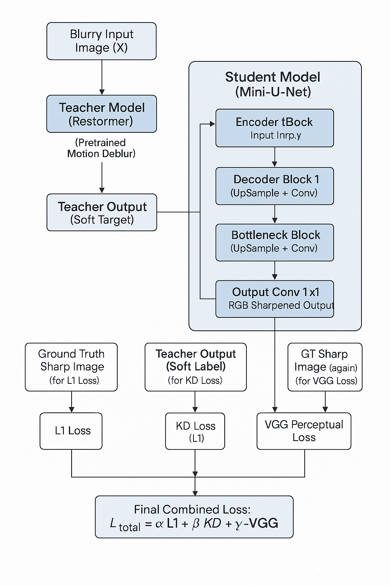

# training/ — Student Model Training

This folder contains the script and visual documentation for training the **student model** (Mini-UNet) using a **knowledge distillation** strategy guided by a pretrained **Restormer** teacher model.

---

## Contents

| File Name                         | Description                                                  |
|----------------------------------|--------------------------------------------------------------|
| `train_student_kd.py`            | Main training script using L1 + KD + optional VGG loss     |
| `Student-Model-Training-Process.png` | Visual flow of the student training pipeline               |
| `README.md`                      | You’re here! Folder-level documentation                    |

---

## Objective

Train a lightweight U-Net model (student) to approximate the performance of a large Restormer model (teacher) while drastically reducing model size and inference time.

---

## Training Script: `train_student_kd.py`

The student is trained with a weighted combination of three loss functions:

```python
Total Loss = L1(output, GT) + λ_kd * L1(output, teacher_output) + λ_vgg * VGG(output, GT)
```

- **L1 Loss**: Direct pixel-wise difference with the ground truth sharp image.
- **KD Loss**: Mimics the teacher output (Restormer).
- **VGG Loss**: Measures perceptual similarity in feature space.

### Key Features:
- Chunked training support (for large datasets)
- Resume from checkpoint
- Patch-based training with `512x512` crops
- Mixed training using multiple loss functions

---

## Visual Flow

The diagram below illustrates the full training flow:



---

## Model Training Configuration

| Setting            | Value                      |
|--------------------|----------------------------|
| Model              | U-Net (depth=4)            |
| Patch Size         | 512×512                    |
| Dataset            | DIV2K (preprocessed, cropped) |
| Teacher            | Pretrained Restormer       |
| Optimizer          | Adam                       |
| Loss Functions     | L1 + KD + VGG              |
| Batch Size         | 8                          |
| Epochs             | Up to 20–30                |
| Checkpoint Resume  | Supported               |

---

## Usage Instructions

```bash
python train_student_kd.py
```

To resume training from checkpoint (automatically detected):
- Ensure `checkpoints/student_checkpoint.pth` exists in root folder

To customize training parameters:
- Modify inside `if __name__ == "__main__":` section in the script

---

## Output Files

After training, the following files are generated:

| File                          | Description                                  |
|-------------------------------|----------------------------------------------|
| `student_model_v1.pth`        | Trained model (L1 + KD)                      |
| `student_model_v2.pth`        | Final model (L1 + KD + VGG)                  |
| `student_checkpoint.pth`      | Resume checkpoint for training continuity    |

These are located under: [`../checkpoints/`](../checkpoints/)

---

## Notebook Integration

This script is fully integrated into the pipeline notebook:

[`ISKD - RESTORMER.ipynb`](../ISKD%20-%20RESTORMER.ipynb)

---

## Notes

- Ensure all blurry/sharp/teacher patches are aligned and exist in:
  ```
  /data/blurry/train/train/
  /data/sharp/train/train/
  /outputs/teacher_output/train/train/
  ```
- For best performance, make sure the `teacher_output` files were generated using the exact patching and naming scheme.

---

